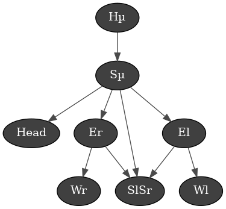
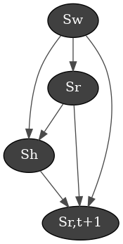

# BeWoDa

**Be**haviours from **Wo**rld **Da**ta

## Input data
* Temperature (inside/outside) : {-20 ; 50} $\pm$ 5 °C  ==> **14 classes**
* Humidity (inside/outside) :  {0 ; 100} $\pm$ 5 %  ==> **20 classes**
* Atmospheric pressure : {850 ; 1050} $\pm$ 50 hPa  ==> **4 classes**
* CO$_2$ concentration : {200 ; 1200} $\pm$ 200 ppm  ==> **5 classes**
* Emotions : {'neutral', 'happy', 'sad', 'surprise', 'anger'}  ==> **5 classes**
* Body position : 18*2 values

Total state (without Body Positions) : $14\times 20 \times 4 \times 5 \times 5 = 28000$.

## States
$$
    s = s_r + s_w + s_h
$$
With $s_r$ the state of Yokobo (position of motors and light colour), $s_w$ the state of the world (temperature, humidity, AP and CO$_2$ level) and $s_h$ the state of the person (body positions and emotions).

Let's see the relationship of the paramters of each state, independently of the other states.

### State of the world : $s_w$
We can draw the DAG as follow:

We can assume that all world data, i.e. meteorological data, are function of the current **time**. Since Yokobo is working with a quite short time approach, we disregarded the current date, that has also an influcence. Then, the **atmospheric pressure** influences the **temperatures**, **humidity data** and **CO2 level**. The latter is also related to inside **humidity** and **temperature**.

### State of the robot (Yokobo) : $s_r$
We can draw the DAG as follow:

The position of the motors an the **LED colour** are independent, beside the link that exists betwen **M2** and **M3**.

### State of the human : $s_h$
We can draw the DAG as follow:

With **Hµ** the mean position between the two hips; **Sµ** the mean position between the two shoulders; **El** and **Er** the left/right elbow position; **Wl** and **Wr** the left/right wrist position; **SlSr** the horizontal distance between the two shoulders.

With this graph, we define the hip as the *orign* of the body, the point that defines the positions of the others. Because for the interaction we have with Yokobo the position of the hips extremities is not important, we can use the mean position. However, for the shoulders, the positions of the left and right is important. Because we are using DAG, we cannot use the position of each shoulders, since we would have a cycle. Then, to overcome this problem, we can add the length between the two shoulders (**SlSr**), we can assume it has no influence on **Sµ**.

*[DAG]: Directed Acyclic Graph

## Bayesian Network
The goal of the Bayesian Network is remember and predict the future state of the robot according the current state

